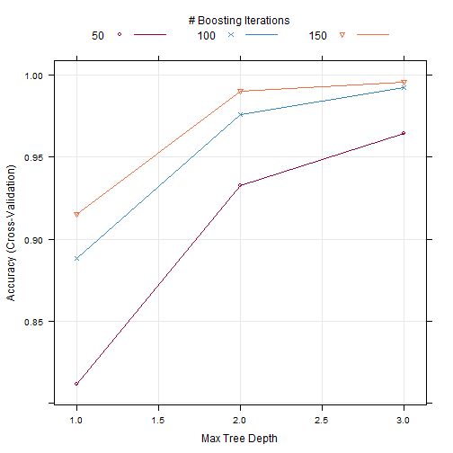

---
---
### Prediction of the manner in which participant did the exercise

### Goal

The aim of this study is to build a model and predict the manner in which participant did the exercise.

### Prediction study design

This section describes steps used to build the final model for prediction.

**Step1: Import and clean data**
In this section, we imported csv data file and remove columns with missing values. These columns have been removed because they contain more than 98% of missing values. The final data set has no missing values.


```r
#Set the work directory
setwd("C:/Users/hp Probook 4540s/Desktop/Machine learning")
#Import data in R
pml=read.csv("./pml-training.csv",na.strings=c("","#DIV/0!",NA))
#summary(pml)
#Select columns with no missing data
name=rep(FALSE,ncol(pml))
for (i in 1:ncol(pml)){
  if (length(na.omit(pml[,i]))==length(pml[,i])){
   name[i]=TRUE 
  }
}
pml=pml[,name]
```

**Step2: split data into training/testing **

As we have a medium sample size, we split data into 60% for training data and 40% for testing data.


```r
#Load caret and rpart packages
library(caret)
```

```
## Loading required package: lattice
## Loading required package: ggplot2
```

```r
library(rpart)
set.seed(2)
#Split data into training/testing
inTrain = createDataPartition(pml$classe,p=0.6,list=FALSE)
#Remove X and times variables
training = pml[ inTrain,-c(1,5)]
testing = pml[-inTrain,-c(1,5)]       
```

**Step3: Cross-Validation strategy **

For cross-validation, we used 10-fold Cross Validation to estimate the accuracy of the predict model. As method, we used Stochastic Gradient Boosting and Trees to estimate parameters of the predict model. Base on accuracy, the best model is Stochastic Gradient Boosting.


```r
set.seed(2)
# define training control with 10-fold cross validation to estimate
contr <- trainControl(method="cv", number=10)
#train the model
mod_rf <- train(training$classe~.,data=training,method="gbm",trControl=contr,verbose=FALSE)
```

```
## Loading required package: gbm
## Loading required package: survival
## Loading required package: splines
## 
## Attaching package: 'survival'
## 
## The following object is masked from 'package:caret':
## 
##     cluster
## 
## Loading required package: parallel
## Loaded gbm 2.1
## Loading required package: plyr
```

```r
#Print the model parameters
print(mod_rf)
```

```
## Stochastic Gradient Boosting 
## 
## 11776 samples
##    57 predictor
##     5 classes: 'A', 'B', 'C', 'D', 'E' 
## 
## No pre-processing
## Resampling: Cross-Validated (10 fold) 
## 
## Summary of sample sizes: 10597, 10598, 10600, 10598, 10598, 10597, ... 
## 
## Resampling results across tuning parameters:
## 
##   interaction.depth  n.trees  Accuracy   Kappa      Accuracy SD
##   1                   50      0.8116483  0.7609891  0.013565668
##   1                  100      0.8882469  0.8585211  0.013311525
##   1                  150      0.9152517  0.8927212  0.013366955
##   2                   50      0.9323202  0.9143255  0.012244136
##   2                  100      0.9757980  0.9693763  0.005705705
##   2                  150      0.9903196  0.9877551  0.003327039
##   3                   50      0.9642499  0.9547555  0.009774983
##   3                  100      0.9923573  0.9903328  0.003124820
##   3                  150      0.9955844  0.9944147  0.002184103
##   Kappa SD   
##   0.017272125
##   0.016845229
##   0.016936401
##   0.015500780
##   0.007220660
##   0.004208227
##   0.012369188
##   0.003952518
##   0.002762633
## 
## Tuning parameter 'shrinkage' was held constant at a value of 0.1
## Accuracy was used to select the optimal model using  the largest value.
## The final values used for the model were n.trees = 150,
##  interaction.depth = 3 and shrinkage = 0.1.
```

```r
#Make a plot of Resampling Profile
trellis.par.set(caretTheme())
plot(mod_rf)
```

 

```r
#make predictions with repart method
pred_rf <- predict(mod_rf, testing)
# summarize results with lda and nb methods
confusionMatrix(pred_rf, testing$classe)
```

```
## Confusion Matrix and Statistics
## 
##           Reference
## Prediction    A    B    C    D    E
##          A 2230    7    0    0    0
##          B    2 1508    6    0    1
##          C    0    3 1354    2    0
##          D    0    0    8 1281    4
##          E    0    0    0    3 1437
## 
## Overall Statistics
##                                           
##                Accuracy : 0.9954          
##                  95% CI : (0.9937, 0.9968)
##     No Information Rate : 0.2845          
##     P-Value [Acc > NIR] : < 2.2e-16       
##                                           
##                   Kappa : 0.9942          
##  Mcnemar's Test P-Value : NA              
## 
## Statistics by Class:
## 
##                      Class: A Class: B Class: C Class: D Class: E
## Sensitivity            0.9991   0.9934   0.9898   0.9961   0.9965
## Specificity            0.9988   0.9986   0.9992   0.9982   0.9995
## Pos Pred Value         0.9969   0.9941   0.9963   0.9907   0.9979
## Neg Pred Value         0.9996   0.9984   0.9978   0.9992   0.9992
## Prevalence             0.2845   0.1935   0.1744   0.1639   0.1838
## Detection Rate         0.2842   0.1922   0.1726   0.1633   0.1832
## Detection Prevalence   0.2851   0.1933   0.1732   0.1648   0.1835
## Balanced Accuracy      0.9989   0.9960   0.9945   0.9971   0.9980
```

**Step4: Prediction accuracy **

With Stochastic Gradient Boosting method, we found that prediction accuracy with testing sample is 99.5% with 95% confident interval =] 0.9937, 0.99,68[. Sensitivity and specificity for the prediction are both 99.91% and 99.88% respectively, suggesting that the model is good for prediction.

### Conclusion

Stochastic Gradient Boosting method is the suitable method to build prediction model to predict the manner in which participant did the exercise.

C:\Users\hp Probook 4540s\Desktop\Machine learning
